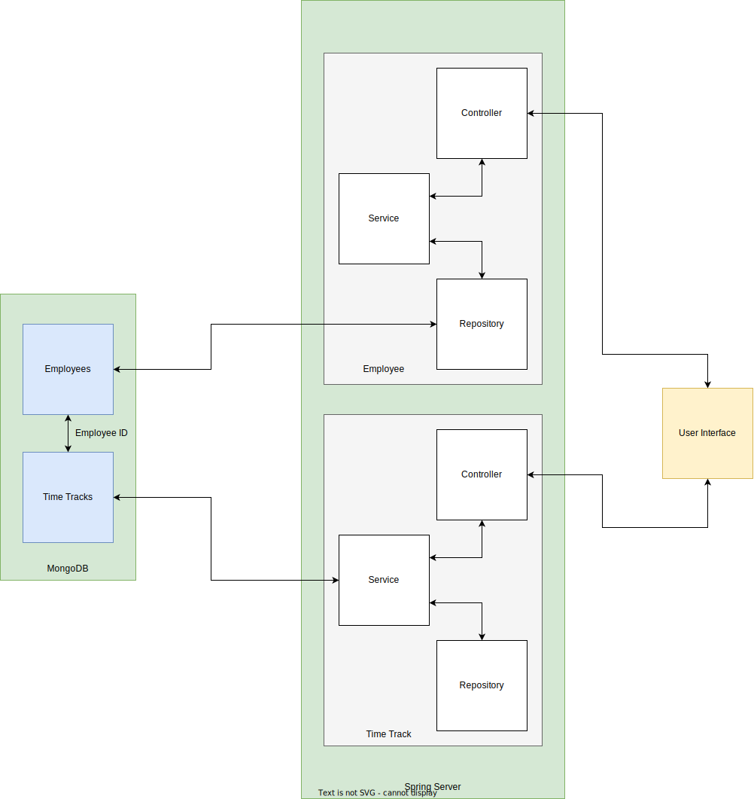

# Table of Content

- [Description](#description)
- [Technologies Used](#technologies-used)
- [Versions](#versions)
- [Block Diagram](#block-diagram)
- [Activity Diagram](#activity-diagram)
- [User Guide](#user-guide)
    - [Server](#server)
    - [Client (Python)](#client-python)
    - [Client (React + Python)](#client-rect--python)
- [Encountered Errors](#encountered-errors)
    - [Server](#server-1)
    - [UI](#ui)

# Description

This is a project that mimic an employee time tracking in a company. The server side is written in *Java* with the help
of **Spring Boot** framework. All the data is stored in a **MongoDB** database using *JSON*. The client side is divided into two separate folders. The **client** folder contains a window application made using *Python* language and **Tkinter** library to manipulate the data. The **client (react + py)** folder contains the *react* part which will be used by the manager to add, delete, update and get different infos about the employees and the *python* part which simulates an app on the employee computer which is used to track the working time.

# Technologies used

- Intellij JetBrains
- PyCharm JetBrains
- Visual Studio Code
- Maven
- MongoDB
- Python
- Java
- Postman
- React
- Node
- JavaScript

# Versions

- IDEs
    - Intellij : 2022.2.3 (Ultimate Edition)
    - Visual Studio Code : 1.73.1 (Universal)
    - PyCharm : 2022.2.3 (Ultimate Edition)
- Server (**Spring**)
    - Java : 1.8.0_351
    - Java : 19.0.1
    - Spring Boot : 2.7.5
    - Swagger UI : 2.9.2 [[link]](https://mvnrepository.com/artifact/io.springfox/springfox-swagger-ui/2.9.2)
    - Swagger2 : 2.9.2 [[link]](https://mvnrepository.com/artifact/io.springfox/springfox-swagger2/2.9.2)
- Database
    - MongoDB : 6.0.1
- Client (**Python**)
    - pip : v22.3.1
    - requests : 2.28.1
    - python : 3.11
    - tkinter
- Client (**React**)
    - node : 18.12.1
    - npm : 8.19.2

# Block Diagram



# Activity Diagram


# User Guide
## Server

1. Clone this repository on your machine using 

```
git clone https://github.com/ceoca-ovidiu/web-app.git
```

2. Open the *server* folder using your preffered IDE (I used Intellij)

3. Make sure you created a database and the cluster in MongoDB as shown [here](https://github.com/ceoca-ovidiu/web-app/blob/main/server/Readme.md)

4. Replace the lines from **src > main > resources > application.properties** with the data matching your database and cluster

5. Start the server

## Client (python)

1. Open the *client* folder 

2. Run the **gui.py** file

```
python3 gui.py
```

3. Follow the instructions from [here](https://github.com/ceoca-ovidiu/web-app/blob/main/client/Readme.md) to find more about the buttons and what they do.

## Client (rect + python)

1. For the *python* UI the steps are the same as above, but the folder is **client (react + py)**

2. For the *react* application you must go to **client (react + py) > client-react** and from here run the following command

```
npm start
```

3. You can find more info about the buttons and the functionalities [here](https://github.com/ceoca-ovidiu/web-app/blob/main/client%20(react%20%2B%20py)/client-python/Readme.md) (for *python*) and [here](https://github.com/ceoca-ovidiu/web-app/blob/main/client%20(react%20%2B%20py)/client-react/README.md) (for *react*)
# Encountered Errors

## Server

1. > Web server failed to start. Port 8080 was already in use. (Server)

Change the port the app is running on with this command:

```
server.port=8081
```

Paste it into **application.properties** file from *resources* folder.

2. > Cannot autogenerate id of type java.lang.Integer for entity of type com.webapp.webapp.model.Employee! (Server)

Change ID from whatever type to String type

See
here: [link](https://stackoverflow.com/questions/71351310/cannot-autogenerate-id-of-type-java-lang-long-for-entity-of-type-entity-mongod)

## UI

3. > Python requests - No connection adapters were found for ... (UI)

You need to include *http://* part before the request call.

See here: [link](https://stackoverflow.com/questions/15115328/python-requests-no-connection-adapters)

4. > Tkinter button automatically call the function on runtime (UI)

You need to call the function using *lambda* expression.

See here: [link](https://stackoverflow.com/questions/3704568/tkinter-button-command-activates-upon-running-program)

5. > Expecting value: line 1 column 1 (char 0)

The request returns nothing which cannot be converted to json.

See here: [link](https://stackoverflow.com/questions/16573332/jsondecodeerror-expecting-value-line-1-column-1-char-0)