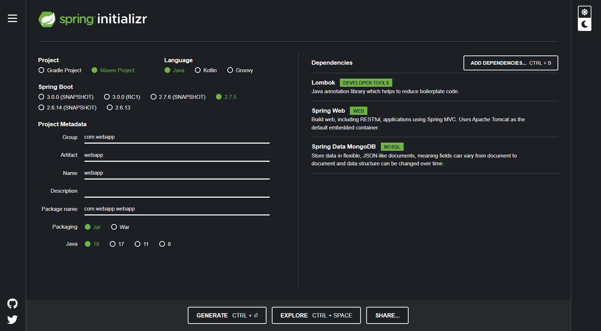

# Table of Content

- [Description](#description)
- [Technologies Used](#technologies-used)
- [Versions](#versions)
- [Database](#database--mongodb)
  - [Connect app to MongoDB](#connect-app-to-mongodb)
  - [Create database](#create-a-database-in-mongodb)
- [Server](#server--spring)
- [User Interface](#user-interface--python)
- [Encountered Errors](#encountered-errors)


# Description

This is a project that mimic an employee time tracking in a company. The server side is written in *Java* with the help of **Spring Boot** framework. All the data is stored in a **MongoDB** database using *JSON*. The GUI is a window application made using *Python* language and **Tkinter** library.

# Technologies used

- Intellij JetBrains
- PyCharm JetBrains
- Visual Studio Code
- Maven
- MongoDB
- Python
- Java
- Postman 

# Versions

- IDEs
  - Intellij : 2022.2.3 (Ultimate Edition)
  - Visual Studio Code : 1.73.1 (Universal)
  - PyCharm : 2022.2.3 (Ultimate Edition)
- Server (**Spring**)
  - Java : 1.8.0_351
  - Java : 19.0.1
  - Spring Boot : 2.7.5
  - Swagger UI : 2.9.2 [[link]](https://mvnrepository.com/artifact/io.springfox/springfox-swagger-ui/2.9.2)
  - Swagger2 : 2.9.2 [[link]](https://mvnrepository.com/artifact/io.springfox/springfox-swagger2/2.9.2)
- Database
  - MongoDB : 6.0.1
- Client (**Python**)
  - pip : v22.3.1
  - requests : 2.28.1
  - python : 3.11
  
# Database ( MongoDB )

1. Create an account [here](https://account.mongodb.com/account/login?n=%2Fv2%2F637b473ab187556c2fc555d9&nextHash=%23metrics%2FreplicaSet%2F637b481a780e9f6fd4236278%2Fexplorer%2Fwebapp%2Femployees%2Ffind)

2. After creating the account you need to create your own cluster

## Connect App to MongoDB

1. From *Database* click **Connect**


2.  Select **MongoDB Drivers**


3. Select **Java** for *Driver* and **4.3 or later** for *Version* and copy the generated text


4. In your project in **application.properties** paste the following line of code and change the URI with the one made for you. Also add your password in the corresponding field.

```
spring.data.mongodb.uri= URI
```

## Create a database in MongoDB

1. From *Database* click **Browse Collections**


2. Here go to **Collections** tab and click on **Create Database**


3. Enter the name of the database and the name of one of first Collection (Table)

4. Also you need to add the database in your **application.properties** so paste there the following line

```
spring.data.mongodb.database= <database_name>
```

# Server ( Spring )



# User Interface ( Python )

The user interface was made with the help of **Tkinter** library and **Tkinter Designer**.

Tkinter Designer is a tool which takes a UI made in *Figma* and translates it into python code. 

Read the instructions and how to use Tkinter Designer [here](https://github.com/ParthJadhav/Tkinter-Designer)


# Color Palette


# Encountered Errors

## Server 

1. > Web server failed to start. Port 8080 was already in use. (Server)

Change the port the app is running on with this command:

```
server.port=8081
```

Paste it into **application.properties** file from *resources* folder.

2. > Cannot autogenerate id of type java.lang.Integer for entity of type com.webapp.webapp.model.Employee! (Server)

Change ID from whatever type to String type

See
here: [link](https://stackoverflow.com/questions/71351310/cannot-autogenerate-id-of-type-java-lang-long-for-entity-of-type-entity-mongod)


## UI

3. > Python requests - No connection adapters were found for ... (UI)

You need to include *http://* part before the request call.

See here: [link](https://stackoverflow.com/questions/15115328/python-requests-no-connection-adapters)

4. > Tkinter button automatically call the function on runtime (UI)

You need to call the function using *lambda* expression.

See here: [link](https://stackoverflow.com/questions/3704568/tkinter-button-command-activates-upon-running-program)

5. > Expecting value: line 1 column 1 (char 0)

The request returns nothing which cannot be converted to json.

See here: [link](https://stackoverflow.com/questions/16573332/jsondecodeerror-expecting-value-line-1-column-1-char-0)