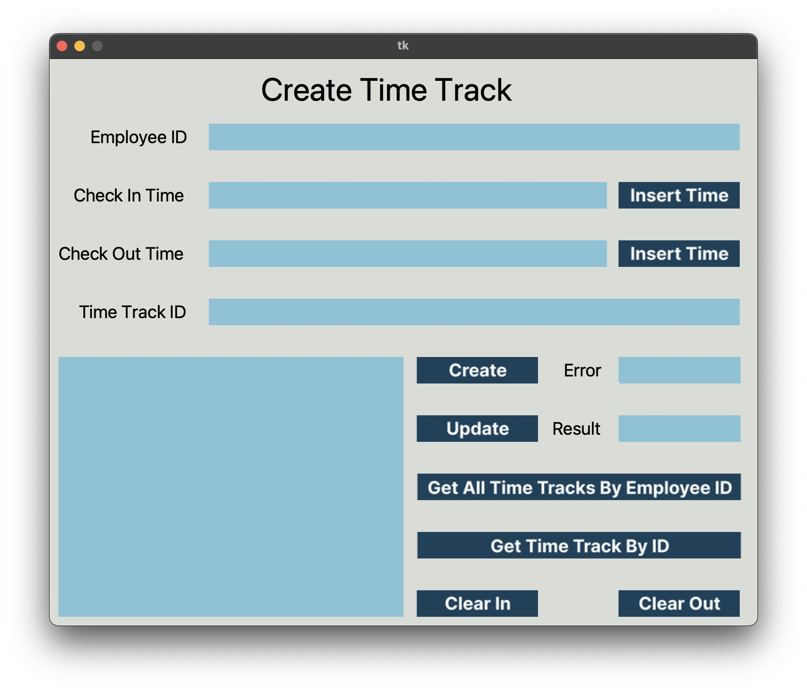

# Table of Content

- [Table of Content](#table-of-content)
- [Description](#description)
- [User Interface](#user-interface)
- [Color Palette](#color-palette)
- [User Guide](#user-guide)

# Description

# User Interface 

The user interface was made with the help of **Tkinter** library and **Tkinter Designer**.

Tkinter Designer is a tool which takes a UI made in *Figma* and translates it into python code.

Read the instructions and how to use Tkinter Designer [here](https://github.com/ParthJadhav/Tkinter-Designer)

# Color Palette

# User Guide

| Request | Name                               | Type   | Input                                                            | Output     | Obs                             |
| ------- | ---------------------------------- | ------ | ---------------------------------------------------------------- | ---------- | ------------------------------- |
| GET     | Get All Time Tracks By Employee ID | Button | Employee ID                                                      | LIST       |                                 |
| GET     | Get Time Track By ID               | Button | Time Track ID                                                    | LIST       |                                 |
| PUT     | Update                             | Button | - Time Track ID - Employee ID - Check in - Check out | TIME TRACK |                                 |
| POST    | Create                             | Button | - Employee ID - Check In - Check Out                     | EMPLOYEE   |                                 |
|         | Clear Out                          | Button |                                                                  |            | Clear all output fields         |
|         | Clear In                           | Button |                                                                  |            | Clear all input fields          |
|         | Insert Time                        | Button |                                                                  |            | Automatically adds current time |

- Info: All input fields have validation methods. The validation process is made on the *client* side.

