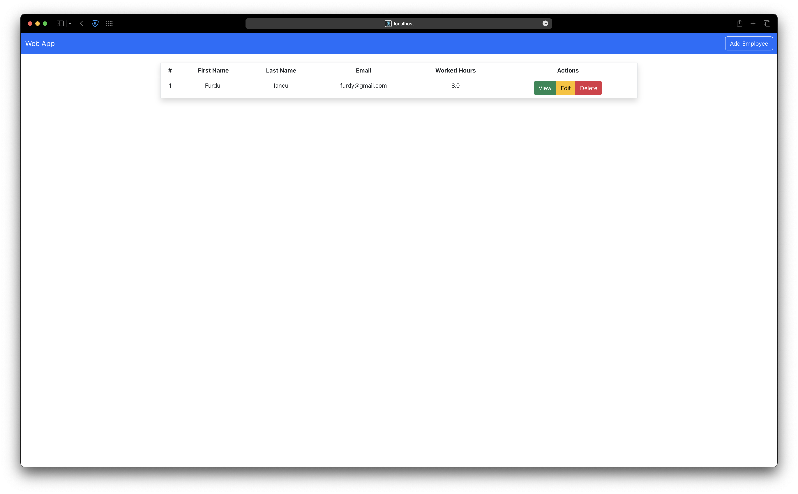
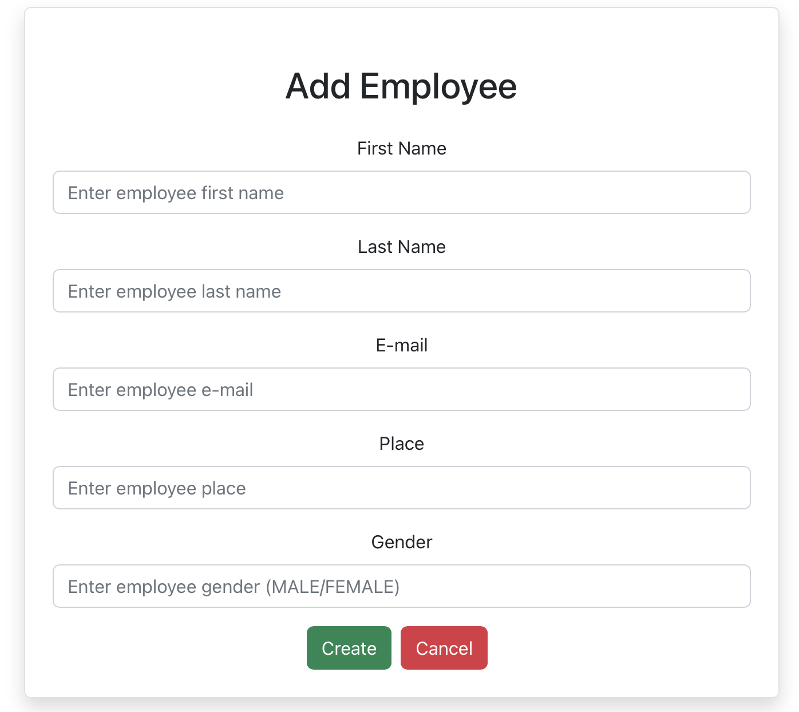
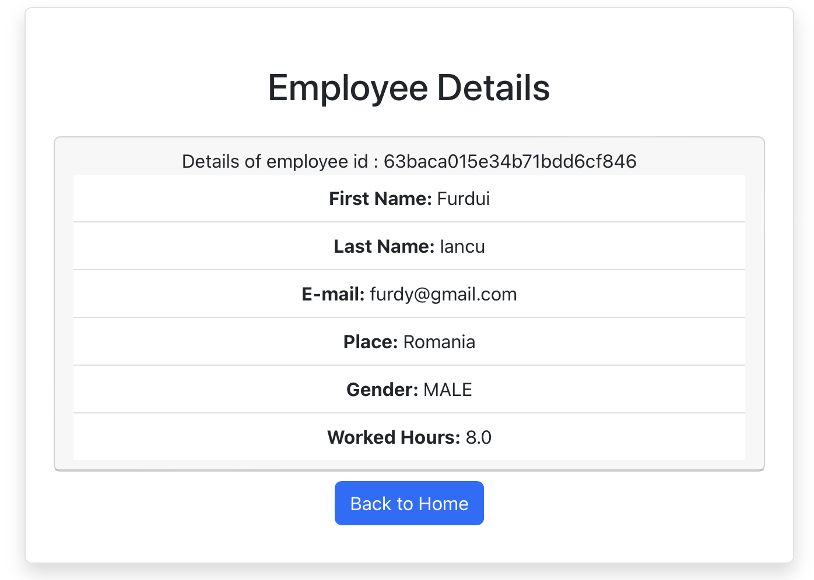
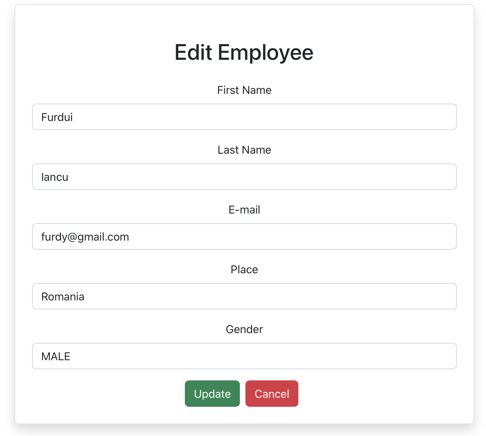

# Table of Content

- [Table of Content](#table-of-content)
- [Description](#description)
- [Install Bootstrap](#install-bootstrap)
- [Install Axios](#install-axios)
- [Install react-router-dom](#install-react-router-dom)
- [User Interface](#user-interface)
  - [Home](#home)
  - [Add Employee](#add-employee)
  - [View](#view)
  - [Edit](#edit)
- [User Guide](#user-guide)

# Description

This is a UI made with *React* framework. It helps the user to see all the employees from the database, to **update** them and **delete**. Also, there is a **create** button on top right which can be use to add more employees. On the *Home* page there is a table which displays the first name, last name, the email and also the worked hours. Next to all, there are 3 action buttons.

# Install Bootstrap

1. Open a terminal from **client-react** folder and paste the following command:

```
npm i bootstrap
```

Bootstrap version: 5.2.3
 
# Install Axios
1. Open a terminal from **client-react** folder and paste the following command:

```
npm i axios
```

Axios version: 1.2.1

# Install react-router-dom
1. Open a terminal from **client-react** folder and paste the following command:

```
npm i react-router-dom
```

react-router-dom version: ^6.6.1

# User Interface

## Home



## Add Employee



## View



## Edit



# User Guide

1. Go to the **client (react + py) > client-react** and open a new terminal

2. To start the application use

```
npm start
```

3. The application should open in your default browser but if it does not then go [here](http://localhost:3000)
