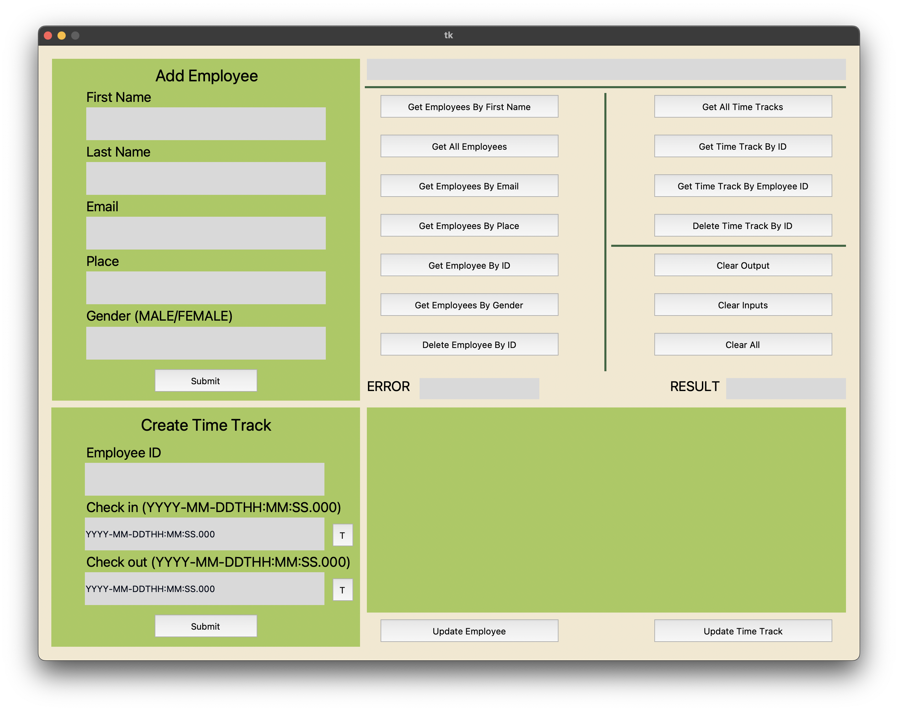

# Table of Content

- [Description](#description)
- [User Interface](#user-interface--python-)
- [Color Palette](#color-palette)
- [User Guide](#user-guide)

# Description

This is the first GUI for the app. It consists of a single window application that is divided into four different
sections. The *Add Employee* section is responsible for adding a new employee to the database while also *validating*
the input. In the same manner, *Create Time Track* is used to create a new time track for a specific employee based on
their ID. The third section is the one with the buttons which manipulates the data from the database and finally, the
fourth section is used to display the result.

# User Interface

The user interface was made with the help of **Tkinter** library and **Tkinter Designer**.

Tkinter Designer is a tool which takes a UI made in *Figma* and translates it into python code.

Read the instructions and how to use Tkinter Designer [here](https://github.com/ParthJadhav/Tkinter-Designer)

# Color Palette

# User Guide

| Request | Name                            | Type   | Input                                                                                     | Output     | Obs                             |
|---------|---------------------------------|--------|-------------------------------------------------------------------------------------------|------------|---------------------------------|
| GET     | Get Employees By First Name     | Button | Employee First Name                                                                       | LIST       |                                 |
| GET     | Get All Employees               | Button |                                                                                           | LIST       |                                 |
| GET     | Get Employees By Email          | Button | Employee Email                                                                            | LIST       |                                 |
| GET     | Get Employess By Place          | Button | Employee Place                                                                            | LIST       |                                 |
| GET     | Get Employee by ID              | Button | Employee ID                                                                               | LIST       |                                 |
| GET     | Get Employees By Gender         | Button | Employee Gender                                                                           | LIST       |                                 |
| GET     | Get All Time Tracks             | Button |                                                                                           | LIST       |                                 |
| GET     | Get Time Track By ID            | Button | Time Track ID                                                                             | LIST       |                                 |
| GET     | Get Time Track By Employee ID   | Button | Employee ID                                                                               | LIST       |                                 |
| DELETE  | Delete Employee By ID           | Button | Employee ID                                                                               | BOOL       |                                 |
| DELETE  | Delete Time Track By ID         | Button | Time Track ID                                                                             | BOOL       |                                 |
| PUT     | Update Employee                 | Button | - Employee ID (Top) - First Name - Last Name - Email - Place - Gender | EMPLOYEE   |                                 |
| PUT     | Update Time Track               | Button | - Time Track ID (TOP) - Employee ID - Check in - Check out                    | TIME TRACK |                                 |
| POST    | Employee Submit Button          | Button | - First Name - Last Name - Email - Place - Gender                         | EMPLOYEE   |                                 |
| POST    | Time Track Submit Button        | Button | - Employee ID - Check in - Check out                                              | EMPLOYEE   |                                 |
|         | Clear Output                    | Button |                                                                                           |            | Clear all output fields         |
|         | Clear Inputs                    | Button |                                                                                           |            | Clear all input fields          |
|         | Clear All                       | Button |                                                                                           |            | Clear all fields                |
|         | T Buttons For Create Time Track | Button |                                                                                           |            | Automatically adds current time |

- Info: All input fields have validation methods. The validation process is made on the *client* side.

