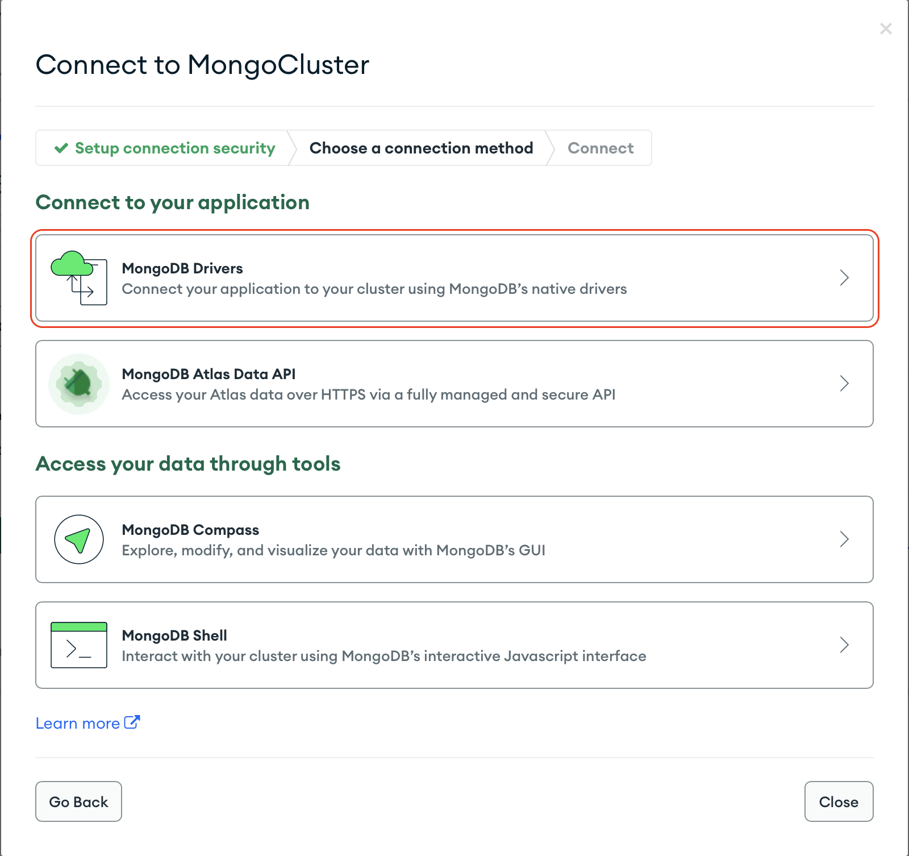
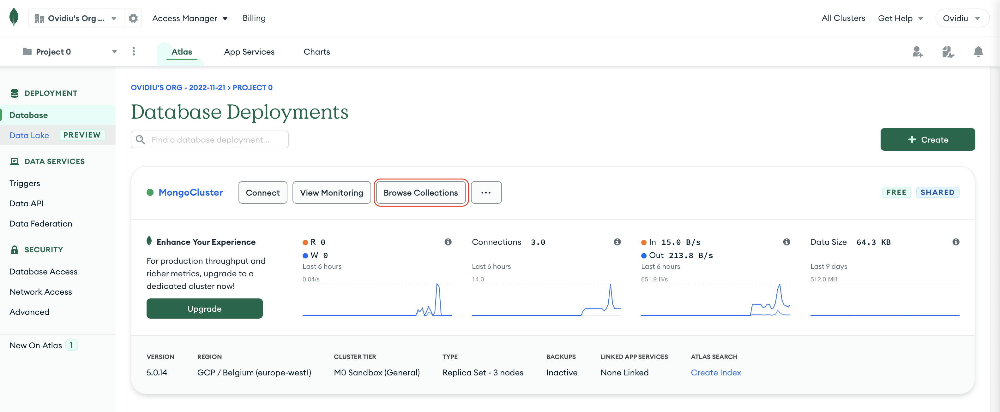

# Table of Content

- [Description](#description)
- [Database](#database--mongodb-)
  - [Connect to MongoDB](#connect-app-to-mongodb)
  - [Create database in MongoDB](#create-a-database-in-mongodb)
- [Spring Initializer](#spring-initializer)

# Description

# Database ( MongoDB )

1. Create an
   account [here](https://account.mongodb.com/account/login?n=%2Fv2%2F637b473ab187556c2fc555d9&nextHash=%23metrics%2FreplicaSet%2F637b481a780e9f6fd4236278%2Fexplorer%2Fwebapp%2Femployees%2Ffind)

2. After creating the account you need to create your own cluster

## Connect App to MongoDB

1. From *Database* click **Connect**


2. Select **MongoDB Drivers**



3. Select **Java** for *Driver* and **4.3 or later** for *Version* and copy the generated text


4. In your project in **application.properties** paste the following line of code and change the URI with the one made
   for you. Also add your password in the corresponding field.

```
spring.data.mongodb.uri= URI
```

## Create a database in MongoDB

1. From *Database* click **Browse Collections**



2. Here go to **Collections** tab and click on **Create Database**


3. Enter the name of the database and the name of one of first Collection (Table)

4. Also you need to add the database in your **application.properties** so paste there the following line

```
spring.data.mongodb.database= <database_name>
```

# Spring Initializer

